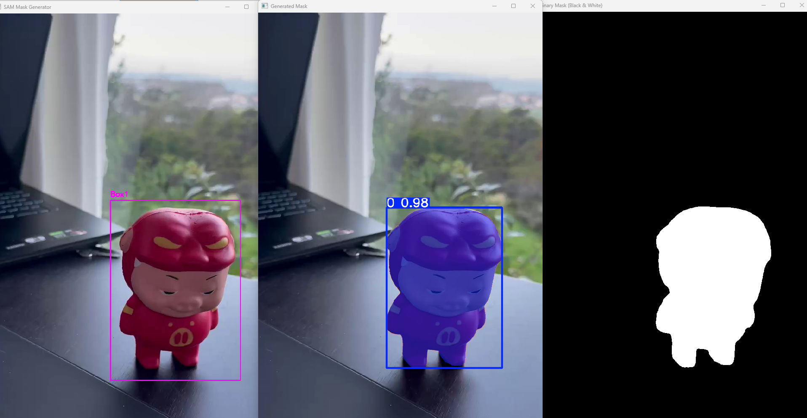
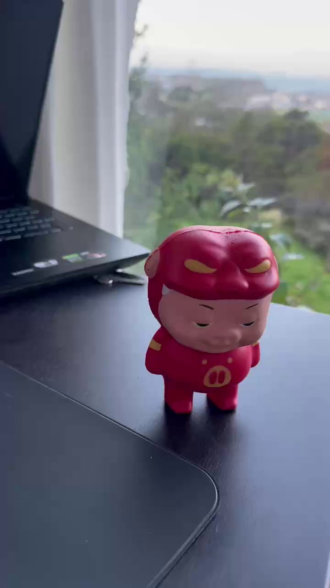

# Good-Segment

<div align="center">

[](https://www.python.org/downloads/)
[](LICENSE)
[](https://opencv.org/)

**让图像分割变得简单高效！**

基于 MobileSAM 的交互式和自动化图像分割工具集  
支持批量处理 | 交互式操作 | 开箱即用

[功能特性](#-功能特性) • [快速开始](#-安装配置) • [使用说明](#-使用说明) • [效果展示](#-效果展示)

</div>

---

## 📷 效果展示

<div align="center">

### 工具界面展示


### 分割效果对比
<table>
  <tr>
    <td align="center"><b>原始图片</b></td>
    <td align="center"><b>生成的 Mask</b></td>
  </tr>
  <tr>
    <td></td>
    <td></td>
  </tr>
</table>

</div>

## ✨ 功能特性

本项目提供三种不同的图像分割工具：

### 1. 交互式批量分割 (`batch_mask_interactive.py`)
- 📦 **批量处理**：逐张处理文件夹中的所有图片
- 🖱️ **手动框选**：为每张图片手动绘制一个或多个框
- 🎯 **精确控制**：完全控制分割区域
- 💾 **自动保存**：自动保存生成的 mask

**适用场景**：需要为每张图片精确指定分割区域

### 2. 自动批量分割 (`batch_mask.py`)
- ⚡ **全自动处理**：无需人工干预
- 🎛️ **多种模式**：
  - 中心点模式
  - 网格点模式（3×3）
  - 全图框模式
  - 中心区域框模式
  - 自定义相对坐标框模式
- 🚀 **高效快速**：适合大批量处理

**适用场景**：批量处理相似构图的图片

### 3. 单图交互式分割 (`interactive_mask.py`)
- 🎨 **点模式**：通过点击前景/背景点进行分割
- 📐 **框模式**：通过绘制矩形框进行分割
- 🔄 **模式切换**：支持点和框混合使用
- 👀 **实时预览**：即时查看分割效果

**适用场景**：测试效果、单图精细分割

## 📋 环境要求

- Python 3.8+
- CUDA（可选，用于 GPU 加速）

## 🔧 安装配置

### 1. 克隆项目

```bash
git clone https://github.com/yo-WASSUP/Good-Segment.git
cd Good-Segment
```

### 2. 安装依赖

```bash
pip install opencv-python
pip install numpy
pip install ultralytics
```

或者使用 requirements.txt：

```bash
pip install -r requirements.txt
```

### 3. 模型文件

✅ **模型已包含**：本项目已包含 `mobile_sam.pt` 模型文件，克隆后即可直接使用，无需额外下载。

> 💡 **模型信息**：
> - 文件名：`mobile_sam.pt`
> - 位置：项目根目录
> - 来源：[MobileSAM](https://github.com/ChaoningZhang/MobileSAM) - 轻量级的 Segment Anything 模型

## 🚀 使用说明

### 方式一：交互式批量分割（推荐）

逐张手动框选，适合需要精确控制的场景。

```bash
# 基本用法
python batch_mask_interactive.py images/test

# 指定输出目录
python batch_mask_interactive.py images/test -o output/masks

# 指定模型路径
python batch_mask_interactive.py images/test -m path/to/mobile_sam.pt
```

**操作说明：**
- 🖱️ **拖拽鼠标**：绘制矩形框（可绘制多个）
- ⌨️ **空格键**：生成 mask 并进入下一张
- ⌨️ **S 键**：跳过当前图片
- ⌨️ **R 键**：重置当前图片的框
- ⌨️ **Q 键**：退出程序

**颜色标识：**
- 🟣 紫色框：正在绘制的框
- 🟢 绿色框：已完成的框

### 方式二：自动批量分割

全自动处理，适合批量处理相似图片。

```bash
# 运行程序
python batch_mask.py
```

按照提示选择模式：
1. **自动模式 - 中心点**：使用图片中心点作为提示
2. **自动模式 - 网格点**：使用 3×3 网格点
3. **框模式 - 整图**：使用整张图片作为框
4. **框模式 - 中心80%**：使用中心 80% 区域
5. **框模式 - 自定义**：输入相对坐标（0-1）

### 方式三：单图交互式分割

适合测试效果和单图精细分割。

```bash
python interactive_mask.py
```

**操作说明：**
- **点模式**：
  - 左键：添加前景点（绿色）
  - 右键：添加背景点（红色）
- **框模式**：
  - 拖拽：绘制矩形框（紫色）
- **通用操作**：
  - 空格键：生成 mask
  - M 键：切换点/框模式
  - R 键：重置所有点和框
  - Q 键：退出程序

> 💡 **提示**：可以同时使用点和框来获得更精确的分割效果！

## 📁 项目结构

```
Good-Segment/
├── batch_mask_interactive.py   # 交互式批量分割工具
├── batch_mask.py               # 自动批量分割工具
├── interactive_mask.py         # 单图交互式分割工具
├── mobile_sam.pt               # MobileSAM 模型文件（已包含）
├── requirements.txt            # Python 依赖配置
├── docs/                       # 文档和示例
│   └── examples/               # 效果展示图片
├── images/                     # 输入图片目录（示例）
│   └── test/                   # 测试图片
├── output/                     # 输出目录（自动创建）
│   └── masks/                  # 生成的 mask
├── .gitignore                  # Git 忽略文件
└── README.md                   # 项目说明文档
```

## 📖 输出格式

所有工具生成的 mask 均为：
- **格式**：PNG 图像
- **类型**：单通道二值图像
- **值域**：
  - 白色（255）：前景/物体
  - 黑色（0）：背景

## 🎯 使用场景

| 工具 | 适用场景 | 优点 | 缺点 |
|------|----------|------|------|
| 交互式批量 | 中等数量图片需要精确分割 | 精确控制，支持多框 | 需要手动操作 |
| 自动批量 | 大量相似构图图片 | 速度快，全自动 | 可能需要调整参数 |
| 单图交互 | 测试效果、单图精细分割 | 灵活性高，支持点+框 | 仅处理单张 |

## ⚠️ 注意事项

1. **模型文件**：项目已包含 `mobile_sam.pt` 模型文件，克隆后即可使用
2. **图片格式**：支持 jpg、jpeg、png、bmp、tiff、webp 格式
3. **内存占用**：处理大图或大批量时注意内存占用
4. **输出覆盖**：输出文件名相同时会覆盖已有文件

## 🐛 常见问题

**Q: 无法加载模型？**  
A: 请确保 `mobile_sam.pt` 在正确的路径，可使用 `-m` 参数指定路径。

**Q: 生成的 mask 不准确？**  
A: 尝试：
- 交互式批量：绘制多个框或调整框的位置
- 自动批量：切换不同的处理模式
- 单图交互：使用点+框混合模式

**Q: 处理速度慢？**  
A: 
- 使用 GPU：安装 CUDA 版本的 PyTorch
- 减小图片尺寸
- 使用自动批量模式的简单配置

## 📝 许可证

本项目基于 MobileSAM 和 Ultralytics，请遵守相应的开源许可证。

## 🙏 致谢

- [MobileSAM](https://github.com/ChaoningZhang/MobileSAM)
- [Segment Anything Model (SAM)](https://github.com/facebookresearch/segment-anything)
- [Ultralytics](https://github.com/ultralytics/ultralytics)

## 🌟 Star History

如果这个项目对您有帮助，欢迎给个 Star ⭐️ 支持一下！

## 📧 联系方式

如有问题或建议，欢迎提交 Issue 或 Pull Request。

---

<div align="center">

**Good-Segment** - 让图像分割更简单 ✨

Made with ❤️ by [Spike Don]

</div>

